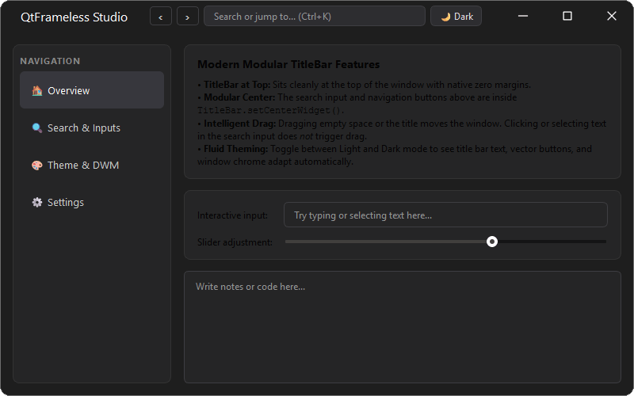

# qtframelesskit

<div align="center">
  

  <p><strong>Modern, cross-Qt frameless window framework for Windows in pure Python.</strong></p>

  <p>
    <a href="https://pypi.org/project/qtframelesskit/"></a>
    <a href="https://pypi.org/project/qtframelesskit/"></a>
    <a href="https://pypi.org/project/PySide6/"></a>
    <a href="https://pypi.org/project/PyQt6/"></a>
    <a href="https://www.microsoft.com/windows"></a>
    <a href="https://github.com/BugCodeX/qtframelesskit/blob/main/LICENSE"></a>
  </p>
</div>

---

<div align="center">
  
</div>

---

## Welcome to qtframelesskit

**qtframelesskit** is a lightweight, pure-Python framework designed to build native-feeling frameless windows in Qt on Windows. It works seamlessly across **PySide6**, **PyQt6**, and **PyQt5** via `qtpy`, with **zero C++ compilation** or binary wheel requirements.

---

## Why Standard Qt Frameless Windows Fall Short

In standard Qt applications, developers typically create a borderless window using:

```python
window.setWindowFlags(Qt.WindowType.FramelessWindowHint)
```

While this removes the operating system's title bar, it strips away fundamental Windows Desktop Window Manager (DWM) capabilities:

| Lost OS Feature | Impact on Standard Qt Frameless Windows | How qtframelesskit Solves It |
| --- | --- | --- |
| **DWM Drop Shadows** | The window becomes flat; developers must emulate shadows by drawing blurry margins in software. | Retains true native DWM drop shadows via non-client frame calculation (`WM_NCCALCSIZE`). |
| **Snap Layouts Menu** | Hovering over custom maximize buttons does nothing on Windows 11. | Full Windows 11 Snap Layouts integration via `WM_NCHITTEST` and `HTMAXBUTTON`. |
| **Smooth Resize Borders** | Edge resizing requires manual mouse tracking, often resulting in jerky, unaccelerated resizing. | Hardware-accelerated native Win32 resize borders with proper cursors and constraints. |
| **System Animations** | Windows lose standard minimize, restore, Aero Shake, and maximize animations. | Retains full DWM system animations and transitions. |
| **Taskbar Collision** | Maximized frameless windows often overlap the Windows taskbar. | Accurately calculates work area boundaries to avoid taskbar overlap. |
| **Fluent Materials** | Cannot easily apply native Windows 11 Mica or Acrylic backdrops. | First-class support for Mica, Mica Alt, and Acrylic blur-behind backdrops. |

`qtframelesskit` restores these native Win32 window mechanics through `ctypes` and `pywin32` while keeping the Qt widget API clean, idiomatic, and non-invasive.

---

## Key Capabilities

<div class="grid cards" markdown>

- :material-dock-window: **Windows 11 Snap Layouts**

    ---

    Hovering over the maximize button triggers the native Windows 11 Snap Layouts flyout menu. Snapping windows into grid layouts works out of the box.

    [:octicons-arrow-right-24: Learn about Snap Layouts](concepts/snap-layouts.md)

- :material-palette-outline: **Mica & Acrylic Backdrops**

    ---

    Native Windows 11 Mica, Mica Alt (tabbed surfaces), and Fluent Acrylic blur-behind materials with customizable tint gradients.

    [:octicons-arrow-right-24: Explore Materials & Styling](guides/styling.md)

- :material-menu: **TitleBar with Integrated QMenuBar**

    ---

    Embed a standard `QMenuBar` directly into the custom title bar with automated Fluent styling, centered titles, and vector control buttons.

    [:octicons-arrow-right-24: Explore TitleBar](guides/titlebar.md)

- :material-layers-outline: **Comprehensive Window Types**

    ---

    Drop-in replacements for `QMainWindow`, `QWidget`, and `QDialog` that automatically configure frameless layouts and event filtering.

    [:octicons-arrow-right-24: View Window Types](guides/windows.md)

</div>

---

## Windows Compatibility

`qtframelesskit` automatically detects the host Windows OS build at runtime and gracefully enables modern features or falls back to supported behavior:

| Feature | Windows 11 22H2+<br>`Build >= 22621` | Windows 11 21H2<br>`Build >= 22000` | Windows 10 1809+<br>`Build >= 17763` |
| --- | :---: | :---: | :---: |
| **Frameless DWM Drop Shadows** | :material-check: Full | :material-check: Full | :material-check: Full |
| **Snap Layouts Hover Menu** | :material-check: Full | :material-check: Full | &mdash; |
| **DWM Rounded Corners** | :material-check: Full | :material-check: Full | &mdash; |
| **Mica Material** | :material-check: Full | :material-check: Full | &mdash; |
| **Mica Alt (Tabbed Material)** | :material-check: Full | &mdash; | &mdash; |
| **Acrylic Blur-Behind** | :material-check: Full | :material-check: Full | :material-check: Full |
| **Dark / Light Theme Sync** | :material-check: Full | :material-check: Full | :material-check: Full |
| **Per-Monitor DPI Scaling** | :material-check: Full | :material-check: Full | :material-check: Full |

!!! note "Platform Requirement"
    `qtframelesskit` relies on native Windows APIs (`dwmapi.dll`, `user32.dll`). On non-Windows platforms (Linux, macOS), importing `qtframelesskit` raises `PlatformNotSupportedError`.

---

## Quick Navigation

- **Ready to start?** Check out the [Getting Started Guide](getting-started.md).
- **Need specific window patterns?** Browse the [Window Types Guide](guides/windows.md).
- **Curious how it works under the hood?** Read about our [Architecture](concepts/architecture.md) and [Snap Layouts Mechanism](concepts/snap-layouts.md).
